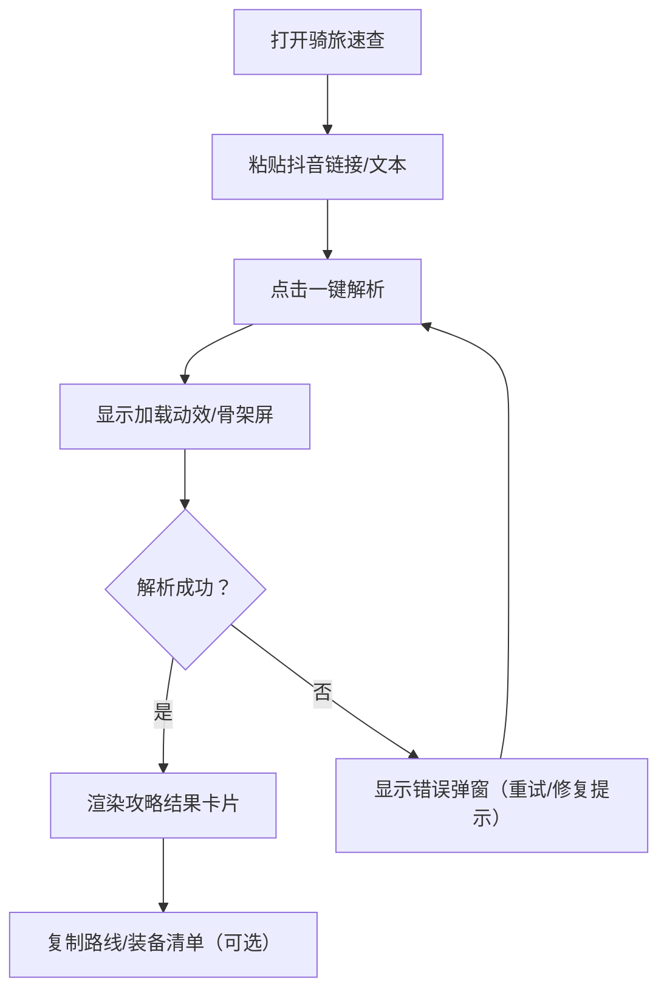

## 1. 产品概述
骑旅速查是一款单页响应式 H5 工具：用户粘贴抖音骑行攻略链接或文本，一键解析并将碎片化内容重构为结构化的短途骑行出行指南。
- 解决问题：短视频信息分散、临时出行缺少完整攻略、关键信息（路线/里程/装备/风险点）难以快速获取
- 目标用户：周末短途骑行、即兴出游、需要快速决策的人群
- 核心价值：用一次操作把“看视频找信息”变成“一屏就能出发的攻略卡片”

## 2. 核心功能

### 2.1 用户角色（可选）
本期不区分角色，不做登录。

### 2.2 功能模块
1. **首页（单页）**：标题与产品卖点、链接/文本输入、一键解析、加载态与错误态、攻略结果卡片渲染、复制/导出/分享（可选）、底部说明

### 2.3 页面详情
| 页面名称 | 模块名称 | 功能说明 |
|---|---|---|
| 首页 | 顶部标题区 | 展示产品名“骑旅速查”、一句话描述、示例链接入口（可选） |
| 首页 | 链接输入区 | 粘贴抖音链接/口令/文本；输入合法性提示；清空；一键解析按钮（主 CTA） |
| 首页 | 加载状态 | 异步请求中展示骨架屏/进度动效；支持取消/重试（可选） |
| 首页 | 错误提示弹窗 | 链接无效/解析失败/超时；给出可操作的修复建议与重试按钮 |
| 首页 | 结果卡片区 | 目的地卡片、骑行类型标签、难度/路况、里程/时长/爬升、关键词标签组、路线文本（分段）、装备清单标签 |
| 首页 | 结果操作区 | 一键复制路线、复制装备清单（MVP）；导出图片/分享链接（备选） |
| 首页 | 定位（备选） | 浏览器定位获取同城路线匹配；定位失败降级为手动城市选择或不展示 |
| 首页 | 底部说明栏 | 数据来源提示、免责声明、反馈入口（可选） |

## 3. 核心流程
用户主流程（MVP）：
1) 用户打开页面 → 2) 粘贴抖音链接/文本 → 3) 点击“一键解析” → 4) 展示加载态 → 5) 返回结构化结果 → 6) 用户浏览路线与关键信息 → 7) 复制路线/装备清单并出发

## 4. 用户界面设计

### 4.1 设计风格
- 视觉方向：户外清新风、简约轻量化、自然原野氛围；清爽卡片式、圆角柔边、留白布局
- 主色：青绿色 #2A9D8F
- 点缀：暖橙 #F4A261
- 背景：浅灰白 #F8F9FA
- 按钮风格：大圆角主按钮（44–48px 高），主色填充；次按钮/幽灵按钮用于“清空/示例/重试”
- 字体与字号：标题 18–22；正文 14–16；关键数字（里程/时长）20–24 并加粗；数字颜色可用暖橙点亮
- 图标风格：扁平化线性图标，统一圆角与线宽，避免重阴影
- 动效建议：页面首屏轻微渐入；解析后卡片分段出现；加载态使用小圆点/骑行轨迹线条动效

### 4.2 页面设计概览
| 页面名称 | 模块名称 | UI 元素 |
|---|---|---|
| 首页 | 顶部标题区 | 标题+副标题；淡色地形纹理/渐变背景；轻微入场动效 |
| 首页 | 链接输入区 | 大输入框+主 CTA；即时校验提示；示例链接（可选） |
| 首页 | 结果卡片区 | 卡片圆角 14–16；轻阴影；模块化信息（目的地/标签/数字/路线/装备） |
| 首页 | 错误弹窗 | 轻量弹窗，不遮挡过多；明确原因+修复建议+重试 |

### 4.3 响应式
- 设计策略：桌面优先 + 移动端自适应
- 桌面：左右分栏（左：输入与说明；右：结果卡片）
- 手机：上下流式排版（输入在上，结果在下），主按钮全宽；标签可换行；长文本可折叠/展开

