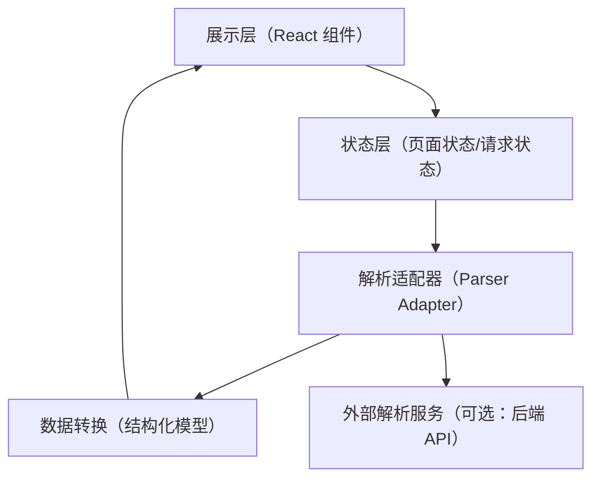

## 1. 架构设计
本期采用纯前端架构（MVP），解析能力先用可替换的“解析适配器”实现：默认使用本地 mock 解析与规则提取；后续可无缝替换为后端/第三方解析服务。



## 2. 技术说明
- 前端：React@18 + TypeScript + Vite
- 样式：Tailwind CSS（用于快速实现卡片、间距、响应式），补充少量自定义 CSS（背景纹理/动效）
- 初始化工具：Vite（React + TS 模板）
- 后端：无（MVP）
- 数据：本地 mock 数据 + 轻量规则提取（MVP）；预留接入 API 的接口层

## 3. 路由定义
单页应用：
| 路由 | 用途 |
|---|---|
| / | 首页（输入 + 解析 + 结果渲染） |

## 4. API 定义（预留，可替换）
MVP 阶段不调用真实抖音解析服务；但为未来接入保留统一接口定义，避免 UI 层绑定具体实现。

### 4.1 结构化结果类型
```ts
export type RideGuide = {
  source: {
    rawInput: string
    kind: "url" | "text"
  }
  destination: {
    title: string
    city?: string
    summary: string
  }
  ride: {
    typeTags: string[]
    difficultyTag?: string
    distanceKm?: number
    durationText?: string
    elevationM?: number
  }
  highlights: string[]
  routeText: string[]
  gearTags: string[]
  riskNotes: string[]
}
```

### 4.2 解析接口（适配器）
```ts
export type ParseInput = {
  text: string
}

export type ParseResult =
  | { ok: true; data: RideGuide }
  | { ok: false; errorCode: "INVALID_INPUT" | "TIMEOUT" | "PARSE_FAILED"; message: string }

export interface ParserAdapter {
  parse(input: ParseInput, signal?: AbortSignal): Promise<ParseResult>
}
```

## 5. 数据模型（前端内聚）
本项目不持久化存储，仅在内存中管理页面状态：
- inputText：用户输入
- status：idle | loading | success | error
- result：RideGuide | null
- error：错误信息（用于弹窗/提示）

